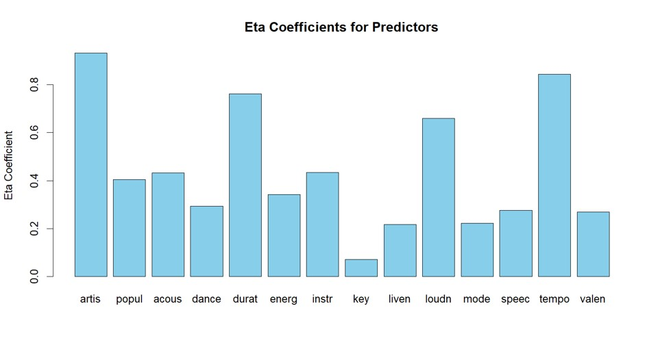
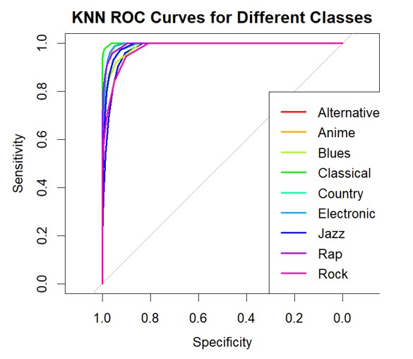
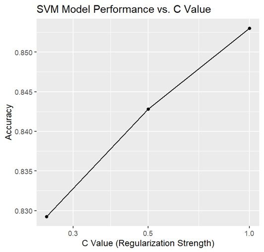
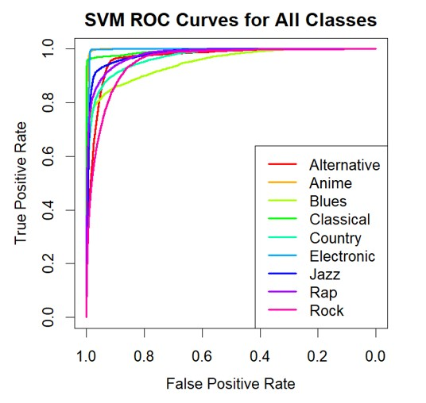
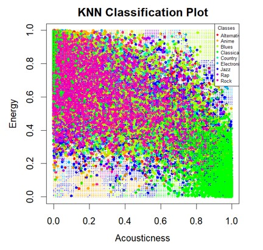
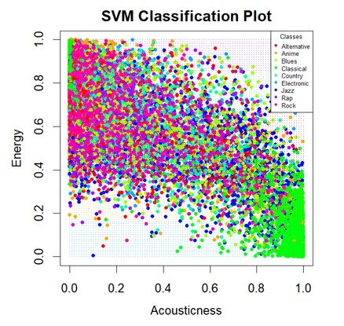
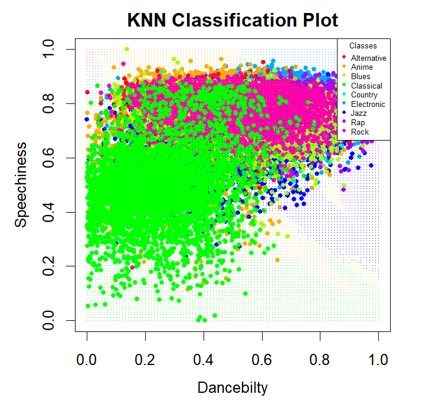
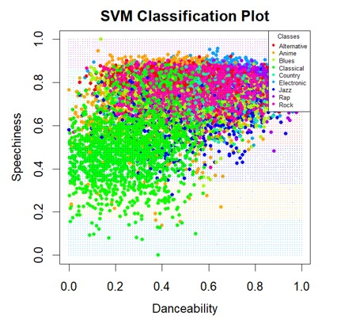

## Summary
# Overview
This repository contains the code for the group final project for Machine Learning Class. The project focuses on predicting music genres using machine learning algorithms implemented in the R programming language.
[Dataset Used](https://www.kaggle.com/datasets/vicsuperman/prediction-of-music-genre/)

## Methods & Results
# Data Preparation
Utilized a dataset with 18 columns, focusing on 14 predictor variables and 1 response variable (music_genre).
Refinement of predictors through feature selection and exclusion of irrelevant columns.
Removed an empty level ('Hip-Hop') in the response variable for data integrity.
Calculated eta coefficients for predictors, resulting in a final set of 11 predictors.

# K Nearest Neighbors (KNN)
Explored KNN algorithm with 5-fold cross-validation.
Determined optimal k value (k=11) through evaluation.
Confusion matrix analysis reveals successful classifications.
One-Vs-All binary classification used for Receiver Operating Characteristic (ROC) curves.
KNN accuracy: 84.15% with 95% CI (0.8378, 0.8451).

# Support Vector Machine (SVM)
Employed SVM algorithm with different C values and 5-fold cross-validation.
Confusion matrix analysis indicates strong performance.
One-Vs-All binary classification used for ROC curves.
SVM accuracy: 87.14% with 95% CI (0.868, 0.8747).

 

# Model Comparison
Compared KNN and SVM accuracy: KNN (84.15%) vs. SVM (87.14%).

<table>
  <tr>
    <td></td>
    <td></td>
  </tr>
</table>

<table>
  <tr>
    <td></td>
    <td></td>
  </tr>
</table>
